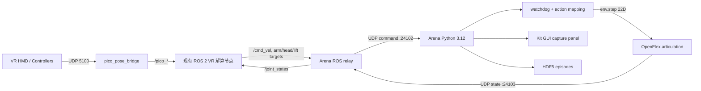

# OpenFlex VR 接入 Arena

## 目标

复用 MRS_ROBOT 中现有的 Pico/Quest UDP 桥、ROS 2 VR 处理节点、双臂 IK、底盘速度映射、升降和头部控制；新增 ROS–Arena 双向桥。Arena 每步仍直接调用仿真 articulation 的 action manager，不在策略执行路径上通过 ROS 控制仿真。

## 进程边界

- ROS 2 进程运行在 ROS Humble/Python 3.10，包含既有 VR 节点和 `integrations/ros2/mrs_robot_arena_bridge`。
- Arena 进程运行 Isaac Sim 6.0 / Isaac Lab 3.0 / Python 3.12，只使用标准库 UDP socket，不导入 `rclpy`。
- ROS domain 固定用仿真专用 `49`。禁止把真机 bringup 或 domain `0` 引入此 launch。
- 默认只监听 localhost：Arena command `127.0.0.1:24102`，仿真 state `127.0.0.1:24103`。

## 命令协议 v1

UDP 每个数据报是一条 JSON 对象，带 `magic=MRSAT`、`version=1`、`type=command`、`session_id`、递增 `seq` 和 `source_time_ns`。关节目标使用物理单位，缺省字段表示该组当前没有新设定值。

- `base_twist`: `[vx, vy, yaw_rate]`，m/s、m/s、rad/s。
- `left_arm_position` / `right_arm_position`: 每臂 7 个绝对关节角，rad。
- `lift_velocity`: 升降 jog，m/s。
- `head_position`: yaw/pitch，rad。
- `left_gripper_position` / `right_gripper_position`: 指关节位置，0–0.044 m。
- 原始 VR 输入字段包含左右手柄 pose (xyz + quaternion)、grip、trigger、joystick 和按钮状态。
- `deadman` 在最近 250 ms 收到有效 VR 控制器位姿且急停未触发时为 true；`estop` 表示 ROS 急停状态。

Arena 状态数据报包含 `type=state`、`seq`、仿真时间以及按 embodiment 契约顺序排列的 19 维关节位置和速度。ROS relay 将其发布为 `/joint_states`，供原有手臂/头部 IK 节点反馈使用。

## 动作语义

本阶段不更改 Arena 已有的 22 维归一化相对关节 action contract：`[base Twist(3), left arm(7), right arm(7), lift(1), head(2), left gripper(1), right gripper(1)]`。ROS 输出绝对目标；Arena 适配器读取当前 articulation 关节状态，按每步最大速度裁剪目标差值，再除以现有 ActionTerm scale 形成相对 action。这样保留训练和键盘诊断的既有语义，也避免绝对角度误作增量。

关节名、ROS topic、单位和绝对限位以 `MRS_ROBOT_sim/ros2_pkgs/openflex_isaac_sim/openflex_isaac_contract/config/embodiment.yaml` 为权威来源。Arena 现有 Swerve ActionTerm 最终会再次裁剪底盘动作。

## 安全

- Arena 使用墙钟 watchdog；250 ms 没有新命令则底盘归零，所有相对关节动作变为零，binary gripper 保持当前开合状态。
- 只接受当前 session 内严格递增的命令序号；旧 session、重复/倒退序号、坏 JSON、错误维数、非有限数值均拒绝。
- ROS deadman 无效、ROS 急停、本地 GUI 急停均禁止运动；复位会清除 watchdog 状态。
- Arena 端另行限幅每步关节增量；ROS IK 节点的步长限制不作为唯一安全层。
- 当前 GUI 急停是仿真侧急停，不是物理机器人安全急停。

## 目前不包含

Arena OpenFlex Embodiment 可选挂载 canonical sensor contract 中的四路 RGB/depth 相机，并由 Arena `camera_obs` 观测组提供给环境调用方。桌面 GUI 启用相机流时，Kit 进程以 JPEG 分片经本机 UDP 发送，ROS relay 重组后发布现有 `/cam_base/color/image/compressed`、`/cam_head/color/image/compressed`、`/cam_left/color/image/compressed`、`/cam_right/color/image/compressed` 话题；统一 LeRobot 采集页复用真机录制器与数据格式。相机默认关闭。Kit 内 VR HDF5 recorder 仍只包含控制与本体状态，不含相机图像。腰部 odom 闭环控制和真机控制器桥接仍需独立阶段实施。
